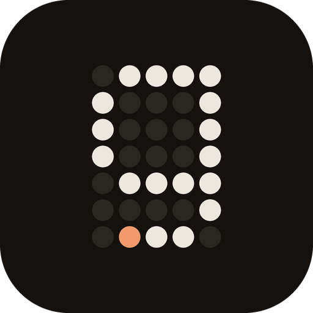

<p align="center">
  
</p>

<h1 align="center">Gofer</h1>

<p align="center">
  <strong>One chat box. Every machine you own.</strong><br>
  A personal agent that runs errands across your tailnet, shows its work live,
  and remembers what it learned.
</p>

<p align="center">
  <a href="https://github.com/r-firth/gofer/actions/workflows/check.yml"></a>
  <a href="LICENSE"></a>
</p>

<p align="center">
  <a href="#quick-start">Quick start</a> ·
  <a href="#keyboard-first">Keyboard</a> ·
  <a href="docs/self-hosting.md">Self-hosting</a> ·
  <a href="docs/architecture.md">Architecture</a> ·
  <a href="docs/memory.md">Memory</a> ·
  <a href="CONTRIBUTING.md">Contributing</a>
</p>

<p align="center">
  <a href="https://github.com/r-firth/gofer/releases/download/media/gofer-showreel.mp4"></a>
</p>

## What is Gofer?

Gofer is a self-hosted agent you talk to in one place. You ask for something;
it decides which of your machines the work belongs on, does it there, and shows
you the terminal or the desktop while it happens. It runs on one machine of
yours and reaches the others over SSH, so there is nothing to install on them
beyond what you already use.

It is not a new model or a new agent loop. The thinking is done by Claude Code
and Codex, signed in with your own subscriptions, running natively on the
machine where the work is. Gofer is the part around them: the conversation,
the machines, the live view and the memory.

Gofer is built for one person and their machines. It acts without asking, so
read [the security notes](#security) before you run it.

## Highlights

- **One chat box that says who it talks to.** Talk to Gofer in a thread, or
  open any Claude or Codex session and talk to it directly. Threads can be
  grouped into projects.
- **Your machines, found for you.** Devices come from Tailscale. A setup panel
  says what each one is missing and fixes what it can.
- **Work you can watch.** Every machine has a live view: a real terminal
  (libghostty), the desktop as video, or both side by side. Take the shell
  over with one key, hand it back with the same key.
- **Computer use on real desktops.** Sessions drive native apps through
  [cua-driver](https://github.com/trycua/cua); the screen streams from
  cua-spacesd over the SSH access Gofer already has.
- **Every step is a row.** Time, tool, what it did, how long it took. Select
  one and the view rewinds to that moment.
- **Memory without being asked.** Before each turn Gofer recalls what bears on
  the message. After it, it writes what it learned as claims linked to the step
  that proves them. Any claim can be marked wrong.
- **Sessions you already have.** Load an existing Claude Code or Codex session
  from any machine, read it, and carry it on.

## Quick start

Gofer's server runs on macOS or Linux. You need Node.js 24+, Rust through
rustup, Python 3.12+ with [uv](https://docs.astral.sh/uv/), tmux 3.x, and the
Claude Code CLI signed in (`claude auth login`). Codex sessions need
`codex login`.

```sh
git clone https://github.com/r-firth/gofer.git
cd gofer
./scripts/setup.sh
cp .env.example .env
npm run build
./scripts/start.sh
```

Open `http://127.0.0.1:4318`. The first thread is there; ask it for something.

Machines appear when the host can reach them with Tailscale SSH or plain
`ssh`. Each one needs tmux, and the Claude Code or Codex CLI for sessions that
run there. Open a machine and press **setup** to see what it has and what it
lacks.

To keep it running on a home server with a tailnet address and HTTPS, see
[Self-hosting](docs/self-hosting.md).

## Keyboard first

| Keys | Action |
| --- | --- |
| `/` | Type a message |
| `s` | Choose who the chat box talks to: a thread, a project, a session |
| `[` `]` | Previous and next thread |
| `1`–`9`, `0` | Show a machine, or all of them |
| `v` | Cycle the machine view: terminal, screen, both |
| `w` | Give the machine view the whole window |
| `t` | Take control of the shell, or hand it back |
| `←` `→`, `l` | Step back and forward through the work; return to live |
| `m` | Open memory |
| `⌘K` | Go to anything |

## How it works

```
browser ── events, terminals, video ──┐
                                      │
                         Rust server (axum)  ── one file: the event log and memory (Vecgra)
                                      │
                 Python worker: Claude Agent SDK, Codex app-server
                                      │
                    ssh ── tmux, claude, codex, cua-driver on each machine
```

Everything that happens is an event in one append-only store. Threads,
sessions, steps and the live view are projections of it, which is why any step
can be replayed. Memory lives in the same file as a graph with embeddings.
[Architecture](docs/architecture.md) has the detail.

## Security

Gofer is a remote control for your machines, and it is meant to be used by you
alone, inside your tailnet.

- Claude runs with permissions bypassed and Codex with full access and no
  approval prompts. Gofer asks before spending money, sending messages as you,
  or deleting things outside its own workspace, because its instructions say
  so, not because anything enforces it.
- On loopback there is no sign-in. Bound to any other address, the server
  refuses to start without an access token of at least 32 characters, and it
  checks the Host and Origin of every request.
- Do not expose it to the internet. Use Tailscale Serve, not Funnel.
- Credentials stay where they are: Gofer uses the CLI sign-ins already on each
  machine and strips its own token from the environment of every agent it
  starts.

## Development

```sh
npm run dev       # UI on :4317, API on :4318
npm run check     # formatting, lints, tests, builds and integration checks
```

The client is React and TypeScript in `web/src/gofer`. The server is Rust in
`crates/hub-server`. The worker in `agent/` hosts the Claude Agent SDK and the
Codex app-server. See [CONTRIBUTING.md](CONTRIBUTING.md).

## License

[Apache 2.0](LICENSE). Vendored [Vecgra](vendor/vecgra/LICENSE) and the bundled
[Nerd Fonts symbols](web/public/fonts/NERD-FONTS-LICENSE) keep their own
licenses.
